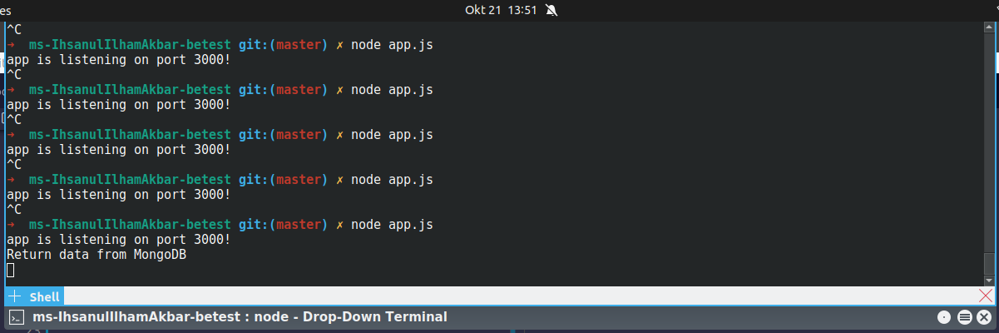
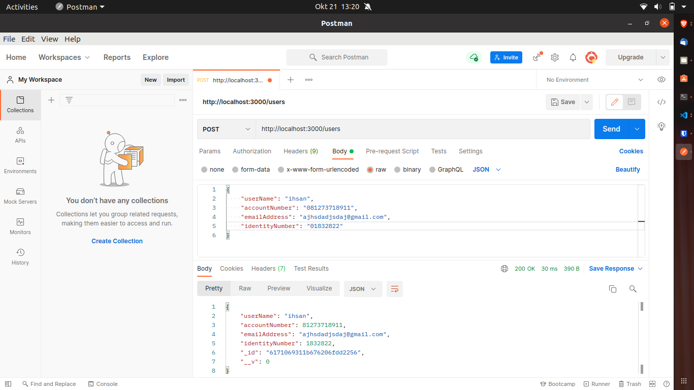
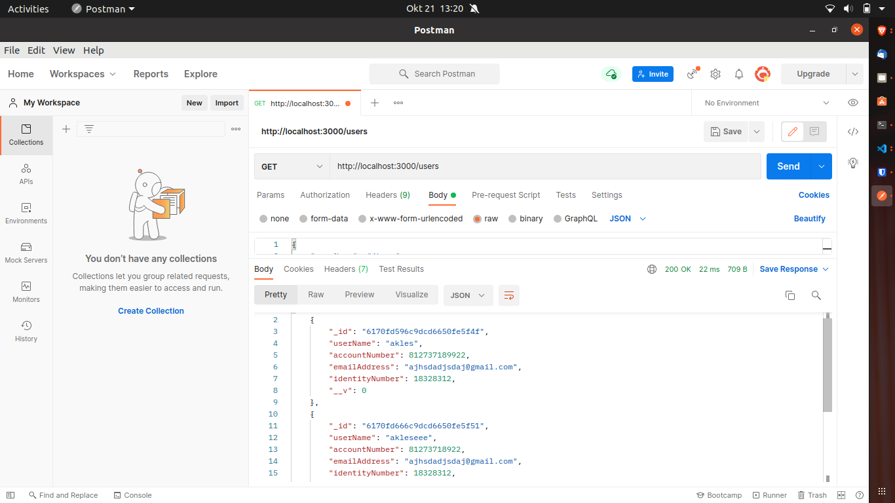
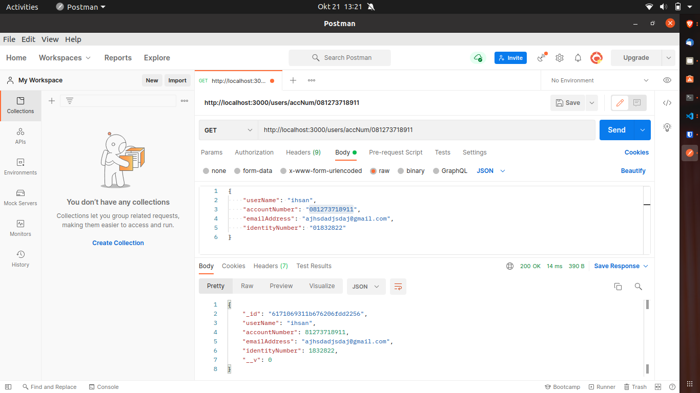
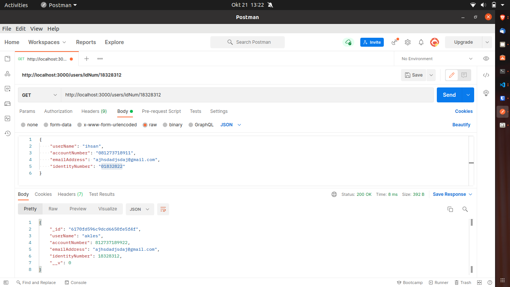
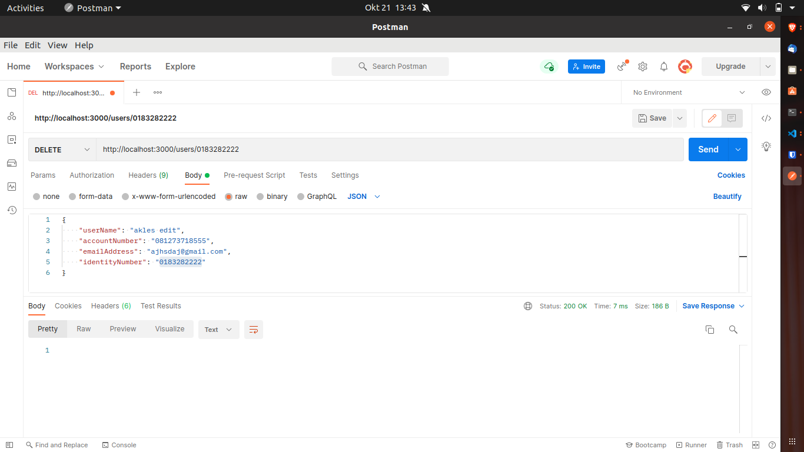

# CRUD API with NodeJS and REDIS
This is a simple CRUD API with NodeJS, MongoDB, and REDIS.

## NodeJS Installation
You can install NodeJS by downloading the latest binaries for your desired operating system from their [official download page](https://nodejs.org/en/download/current/).

## Redis Installation

### Mac

you can install redis uning [homebrew](http://brew.sh).

run `brew install redis` in terminal to install redis on your mac using homebrew, assuming you have homebrew installed.

### Linux

You can learn how to install redis on Linux [here](https://community.pivotal.io/s/article/How-to-install-and-use-Redis-on-Linux)

### Windows

You can learn how to install redis on Windows [here](https://redislabs.com/ebook/appendix-a/a-3-installing-on-windows/a-3-2-installing-redis-on-window/)

## Setting up

* clone the repo
* change directory
* run `npm install`
* run `npm start`
* visit http://localhost:3000

## Body Parameters
The API expect the following Parameters:  
`userName` of type string  
`accountNumber` of type number  
`emailAddress` of type string  
`identityNumber` of type number  

## Using Postman
Make sure post is set to `x-www-form-urlencoded`
* add user (POST): `/users`
* delete user (DELETE): `/users/{id}`
* get all user (GET): `/users`
* get a user by account number (GET): `/users/accNum/{accountnumber}`
* get a user by identity number (GET): `/users/accNum/{identitytnumber}`
* update a user (PUT): `/users/{id}`
### Add user

### Get all users

### Get a user by account number

### Get a user by identity number

### Update a user

### Delete a user
